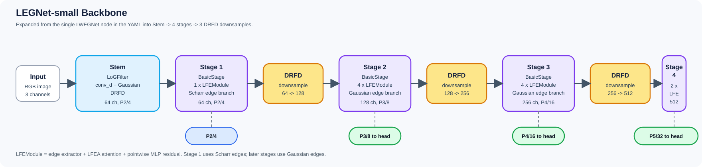
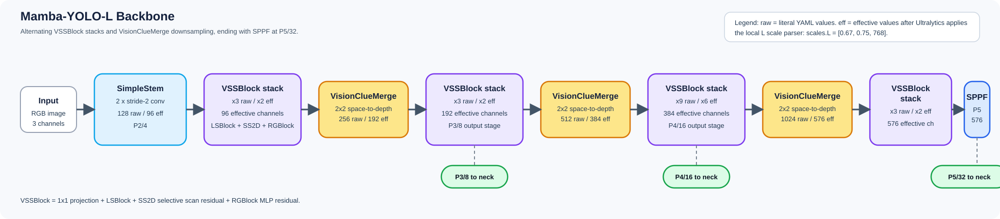

# LEGNet and Mamba-YOLO Backbone Diagrams

This page expands two local backbone configs into stage diagrams:

- `ultralytics/cfg/models/legnet/legnet-small.yaml`
- `ultralytics/cfg/models/mamba-yolo/Mamba-YOLO-L.yaml`

The diagrams also reflect the backing module implementations in `ultralytics/nn/modules/legnet.py` and `ultralytics/nn/modules/mamba_yolo.py`.

## LEGNet-small Backbone

LEGNet-small wraps its full backbone in one `LWEGNet` YAML node, but that module expands into a `Stem`, four `BasicStage` groups, and three `DRFD` downsamples. The backbone returns `P2`, `P3`, `P4`, and `P5`; the detection head indexes `P3`, `P4`, and `P5`.

- `stem_dim=64`
- `depths=[1, 4, 4, 2]`
- Output channels by stage: `64 -> 128 -> 256 -> 512`

## Mamba-YOLO-L Backbone

The Mamba-YOLO-L backbone alternates `VSSBlock` stacks with `VisionClueMerge` downsampling stages and finishes with `SPPF` at `P5/32`.

The labels in the diagram show both:

- `raw`: the literal channel and repeat values from the YAML
- `eff`: the effective values after Ultralytics applies `scales.L = [0.67, 0.75, 768]` during model parsing

`P3`, `P4`, and `P5` are the features passed into the neck and detection head.
