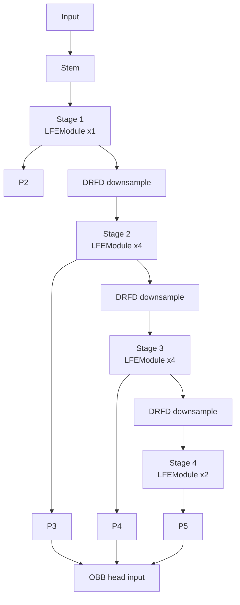
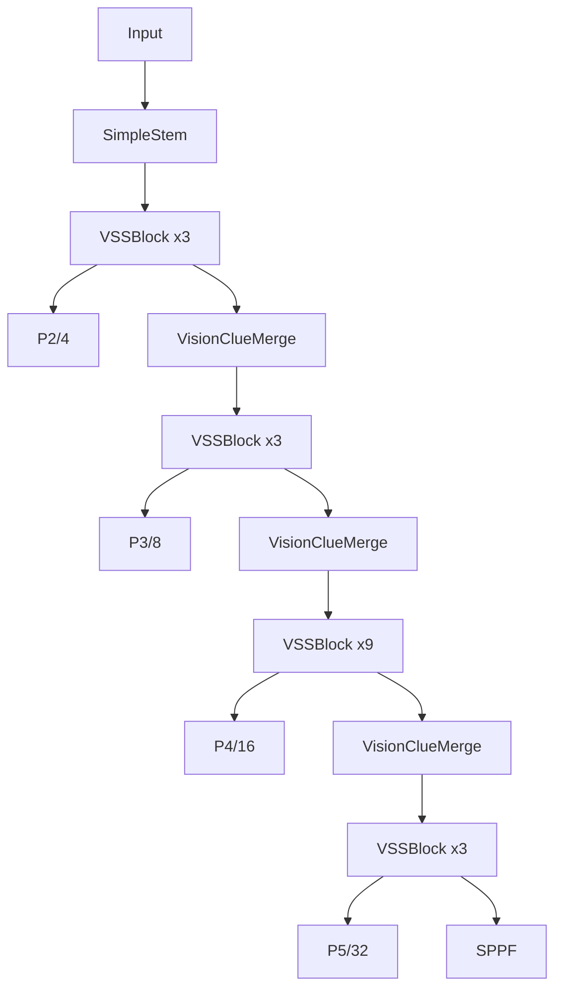
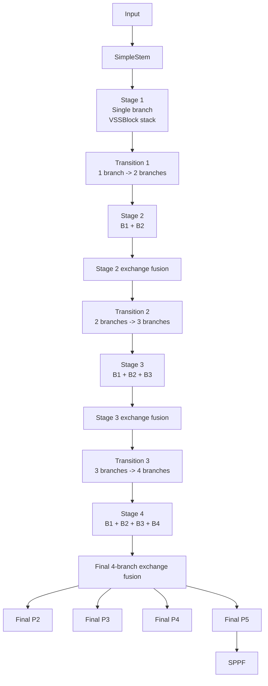
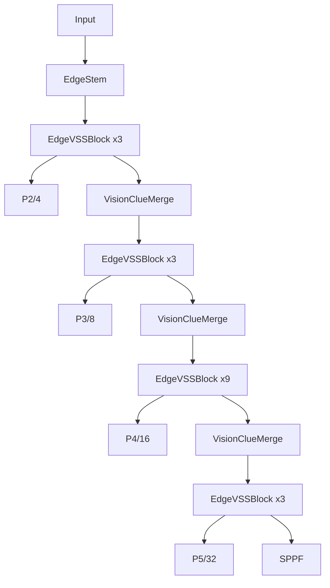
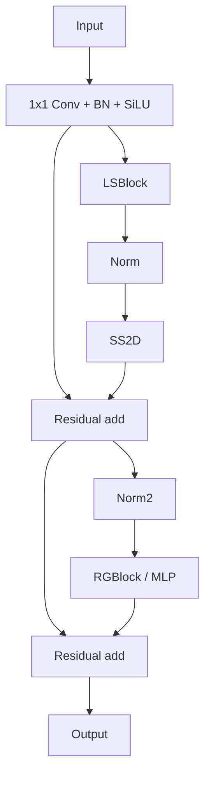
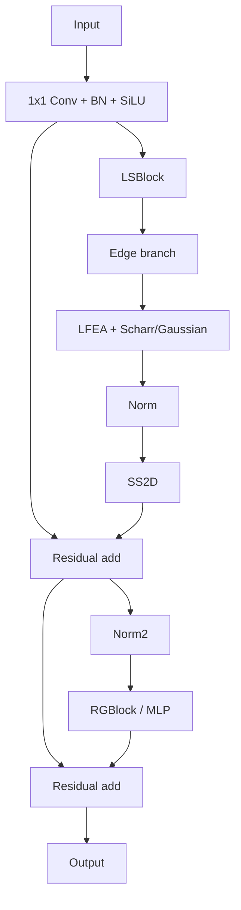
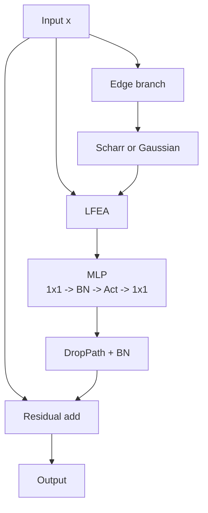

# Backbone Flowcharts

Simple structure-only diagrams for:

- `legnet-small-obb.yaml`
- `Mamba-YOLO-L.yaml`
- `VSSBlock`
- LEGNet `LFEModule`

## LEGNet-small-OBB Backbone

## Mamba-YOLO-L Backbone

## Mamba-HRNet-OBB Backbone

## YOLO-Mamba-Seg-EdgeVSS-All Backbone

## VSSBlock

## EdgeVSSBlock

## LEGNet LFEModule

